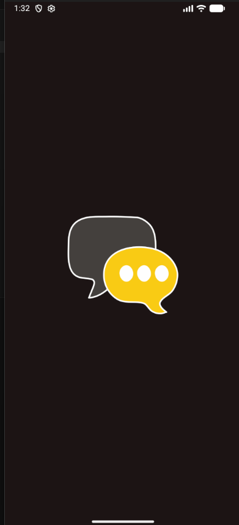
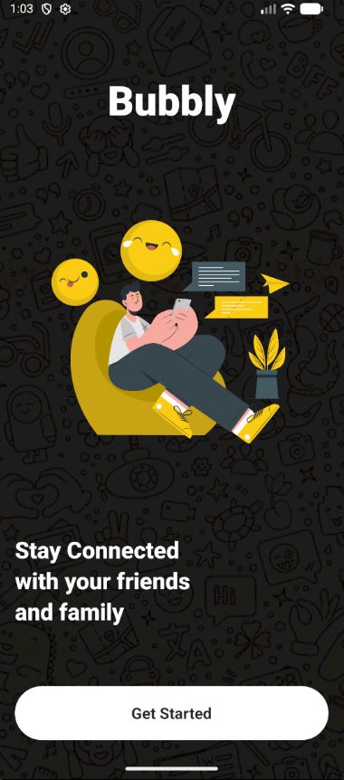
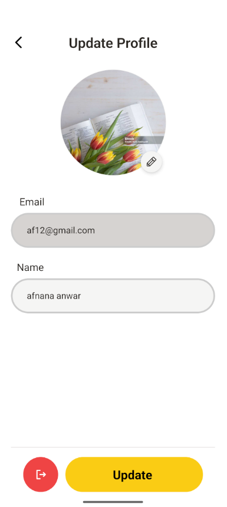
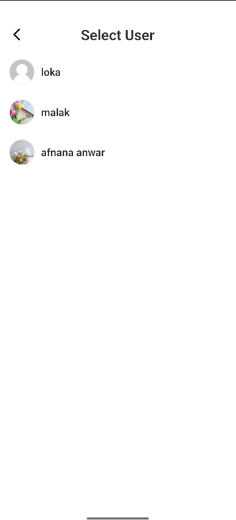
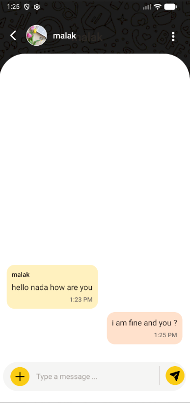
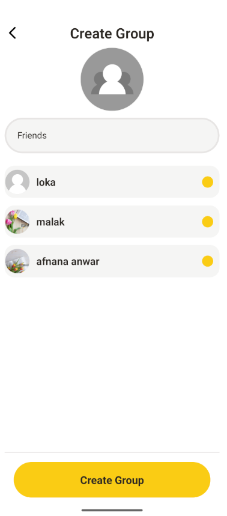
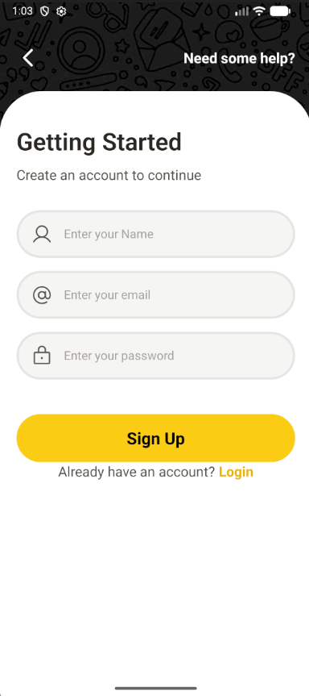
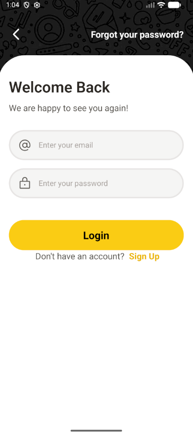
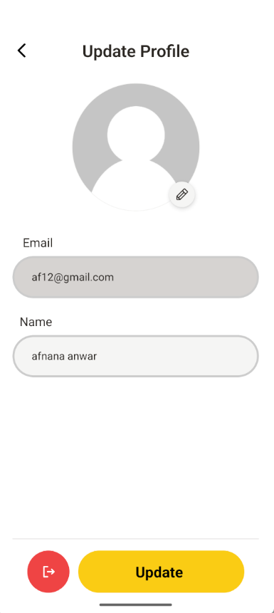

# 💬 ChatApp

A real-time mobile chat application built with **React Native (Expo)** and a **Node.js** backend. Supports one-on-one and group conversations with live messaging over WebSockets and image sharing.

---

## 📱 Screenshots

<div align="center" style="display: flex; gap: 20px; justify-content: center; flex-wrap: wrap;">
  
  <figure style="text-align: center;">
    
    <figcaption>first.png</figcaption>
  </figure>

  <figure style="text-align: center;">
    
    <figcaption>second.png</figcaption>
  </figure>

  <figure style="text-align: center;">
    
    <figcaption>third.png</figcaption>
  </figure>

  <figure style="text-align: center;">
    
    <figcaption>fourth.png</figcaption>
  </figure>

  <figure style="text-align: center;">
    
    <figcaption>fifth.png</figcaption>
  </figure>

  <figure style="text-align: center;">
    
    <figcaption>sixth.png</figcaption>
  </figure>

  <figure style="text-align: center;">
    
    <figcaption>seventh.png</figcaption>
  </figure>

  <figure style="text-align: center;">
    
    <figcaption>eith.png</figcaption>
  </figure>

  <figure style="text-align: center;">
    
    <figcaption>ninth.png</figcaption>
  </figure>

  <figure style="text-align: center;">
    
    <figcaption>ten.png</figcaption>
  </figure>

</div>

## ✨ Features

- 🔐 User authentication (register / login / logout)
- 💬 Real-time one-on-one messaging via WebSockets
- 👥 Group chat creation and management
- 🖼️ Image sharing within conversations
- 🟢 Online / offline presence indicators
- 🔔 Message notifications
- 📱 Fully responsive mobile UI built with Expo

---

## 🛠️ Tech Stack

### Frontend (Mobile)
| Technology | Purpose |
|---|---|
| React Native | Cross-platform mobile framework |
| Expo | Development & build toolchain |
| TypeScript | Type-safe codebase |
| Socket.io Client | Real-time WebSocket communication |

### Backend
| Technology | Purpose |
|---|---|
| Node.js | Runtime environment |
| Express.js | REST API framework |
| Socket.io | WebSocket server for real-time events |
| MongoDB + Mongoose | Database & ODM |
| JWT | Authentication & session management |

---

## 📁 Project Structure

```
ChatApp/
├── frontend/                  # React Native (Expo) mobile app
│   ├── components/            # Reusable UI components
│   ├── screens/               # App screens (Chat, Home, Login...)
│   ├── navigation/            # Stack & tab navigation
│   ├── hooks/                 # Custom React hooks
│   ├── context/               # Global state & socket context
│   ├── services/              # API service calls
│   └── types/                 # TypeScript type definitions
│
├── backend/                   # Node.js / Express server
│   ├── controllers/           # Route handlers
│   ├── models/                # Mongoose schemas (User, Message, Room)
│   ├── routes/                # REST API routes
│   ├── middleware/            # Auth & error middleware
│   ├── socket/                # Socket.io event handlers
│   └── config/                # DB & environment config
│
└── package.json
```

---

## ⚙️ Getting Started

### Prerequisites
- Node.js >= 18
- MongoDB (local or Atlas)
- Expo CLI (`npm install -g expo-cli`)
- Expo Go app on your phone — or an iOS/Android simulator

---

### 1. Clone the repository
```bash
git clone https://github.com/Aalaa-magdy/ChatApp.git
cd ChatApp
```

### 2. Setup the Backend
```bash
cd backend
npm install
```

Create a `.env` file inside `backend/`:
```env
PORT=5000
MONGO_URI=your_mongodb_connection_string
JWT_SECRET=your_jwt_secret
CLIENT_URL=http://localhost:8081
```

Start the backend server:
```bash
npm run dev
```

### 3. Setup the Frontend
```bash
cd frontend
npm install
```

Create a `.env` file inside `frontend/`:
```env
EXPO_PUBLIC_API_URL=http://YOUR_LOCAL_IP:5000
```

> ⚠️ Use your machine's **local IP address** (e.g. `192.168.x.x`), not `localhost` — Expo on a physical device can't reach `localhost`.

Start the Expo app:
```bash
npx expo start
```

Scan the QR code with **Expo Go** on your phone, or press `i` / `a` to open in simulator.

---

## 🔌 API Endpoints

| Method | Endpoint | Description |
|---|---|---|
| POST | `/api/auth/register` | Register a new user |
| POST | `/api/auth/login` | Login & receive JWT |
| GET | `/api/users` | Get all users |
| GET | `/api/conversations` | Get user's conversations |
| POST | `/api/conversations` | Create a new conversation |
| GET | `/api/messages/:conversationId` | Get messages in a conversation |
| POST | `/api/messages` | Send a new message |

---

## ⚡ Real-Time Socket Events

| Event | Direction | Description |
|---|---|---|
| `connection` | Client → Server | User connects |
| `join_room` | Client → Server | Join a chat room |
| `send_message` | Client → Server | Send a message |
| `receive_message` | Server → Client | Receive a new message |
| `user_online` | Server → Client | Notify user is online |
| `user_offline` | Server → Client | Notify user is offline |
| `typing` | Client → Server | User is typing indicator |

---

## 🧠 Key Implementation Highlights

- **WebSocket architecture** using Socket.io for sub-100ms real-time message delivery
- **JWT-based auth** with protected REST routes and socket handshake verification
- **Room-based messaging** — each conversation maps to a dedicated socket room
- **TypeScript throughout** the frontend for type-safe components, hooks, and API calls
- **Optimistic UI updates** — messages appear instantly before server confirmation
- **Image sharing** with upload support and preview in the chat thread

---

## 👩‍💻 Author

**Alaa Magdy**
- GitHub: [@Aalaa-magdy](https://github.com/Aalaa-magdy)

---

## 📄 License

This project is open source and available under the [MIT License](LICENSE).
